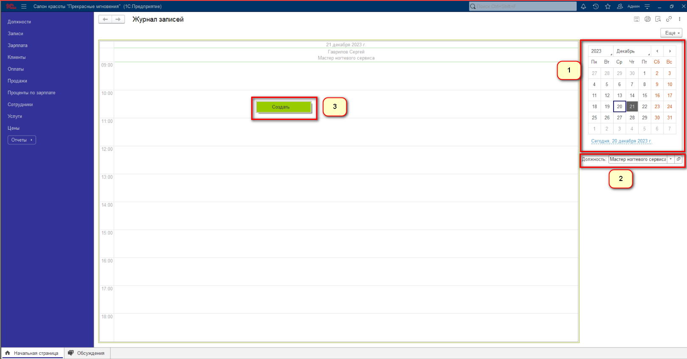
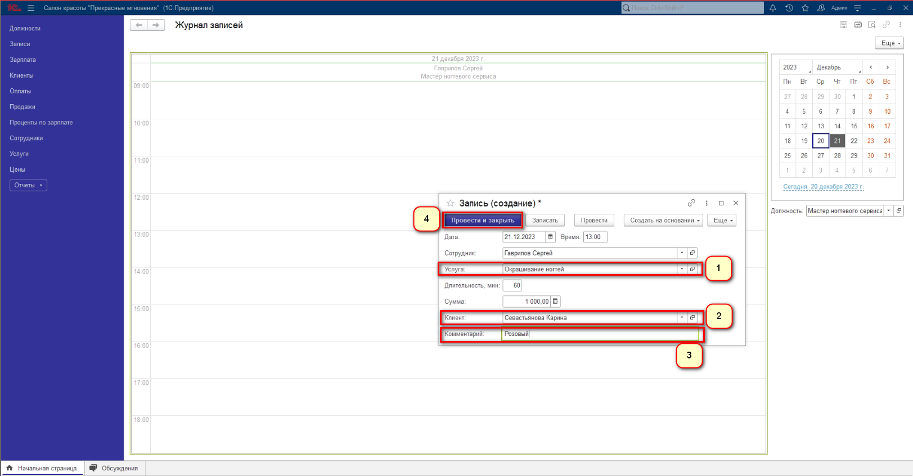

<h3 align="center">АИС “Прекрасные мгновения”</h3>
 

   Климкин Никита, Панков Егор - студенты группы 1201 

## О программе

АИС “Прекрасные мгновения” предназначена для автоматизации процессов управления и учета в салоне красоты. Система позволяет вести базу клиентов, управлять записью на сеанс, вести учет услуг, а также управлять финансовой и административной деятельностью.   
Пользователи данной системы – это сотрудники салона красоты, включая административный и рабочий персонал. Система предоставляет возможность добавления, изменения и удаления информации о клиентах, сотрудниках, услугах и финансовой деятельности. Вся введенная информация является входной для системы. Выходная информация включает отчеты о работе и финансовые отчеты.

### Добавление новой записи на сеанс:  

Для того, чтобы добавить новую запись на сеанс, Работник должен выбрать дату в календаре (1), затем выбрать "Должность" (2), после в области журнала нажать правой кнопкой мыши и создать (3)   

В открывшейся форме необходимо выбрать услугу (1), затем выбрать клиента (2), а после написать комментарий (3) (Комментарий необязателен), в конце нажать "Провести и закрыть" (4). Остальные данные подтягиваются автоматически    

